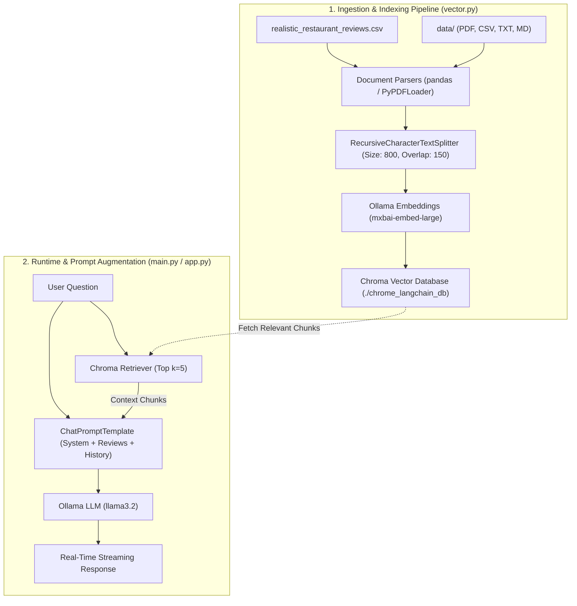

# 🍕 Local Pizza Restaurant RAG QA Assistant

A powerful, 100% local **Retrieval-Augmented Generation (RAG)** assistant built with **LangChain**, **Ollama**, **ChromaDB**, and **Streamlit** to answer questions and provide recommendations based on customer reviews and uploaded restaurant documentation.

---

## 🌟 Key Features

* **🔒 100% Local & Private**: No cloud API keys required. Everything runs locally on your machine via **Ollama**.
* **⚡ Dense Semantic Vector Search**: Powered by **ChromaDB** and the **`mxbai-embed-large`** embedding model (1024 dimensions).
* **🧠 High-Performance Local LLM**: Powered by **`llama3.2`** for natural reasoning, customer advice, and grounded Q&A.
* **🖥️ Dual Interfaces**:
  * **Interactive Web Dashboard ([app.py](file:///Users/sovannarith/Desktop/LocalAIAgentWithRAG/app.py))**: Modern Streamlit UI with file uploads, source expanders, and real-time streaming.
  * **Terminal CLI ([main.py](file:///Users/sovannarith/Desktop/LocalAIAgentWithRAG/main.py))**: Lightweight REPL chat loop for quick command-line queries.
* **📁 Dynamic Multi-Format Ingestion**: Upload custom menus and reviews in **PDF**, **CSV**, **TXT**, or **Markdown** (`.md`) format on-the-fly.
* **🔍 Source Transparency**: Expandable view showing exact chunks and source files used to generate answers.
* **💬 Multi-Turn Conversation Memory**: Retains conversation history for natural follow-up questions.

---

## 🏗️ Architecture Overview



---

## 📁 Repository Structure

```text
LocalAIAgentWithRAG/
├── app.py                             # Streamlit Web Application
├── main.py                            # Interactive CLI Terminal Chat
├── vector.py                          # Ingestion, Chunking & Chroma Vector Store
├── retrieval.py                       # Standalone Vector Retriever Helper & Tests
├── splitter.py                        # Text Splitting & Header Parsing Utilities
├── realistic_restaurant_reviews.csv   # Default Dataset (124 Customer Reviews)
├── data/                              # Uploaded User Documents (PDFs, Menus, etc.)
├── chrome_langchain_db/               # Persistent ChromaDB Database Folder
├── requirements.txt                   # Python Dependencies
├── Pipfile & Pipfile.lock             # Pipenv Environment Files
└── README.md                          # Documentation
```

---

## 🚀 Prerequisites

### 1. Install Ollama
Download and install Ollama from [ollama.com](https://ollama.com/).

### 2. Pull Required AI Models
Ensure Ollama is running, then open your terminal and pull the LLM and Embedding models:

```bash
# Pull the Large Language Model
ollama pull llama3.2

# Pull the Embedding Model
ollama pull mxbai-embed-large
```

---

## 🛠️ Installation & Setup

### Clone the Repository
```bash
git clone https://github.com/Soeun-Sovannarith/RAG_Implementation.git
cd LocalAIAgentWithRAG
```

### Option A: Using `pip` (Standard)
```bash
# Create a virtual environment (recommended)
python3 -m venv venv
source venv/bin/activate    # On Windows: venv\Scripts\activate

# Install dependencies
pip install -r requirements.txt
```

### Option B: Using `Pipenv`
```bash
pipenv install
pipenv shell
```

---

## 🏃 Running the Application

### 1. Launch the Streamlit Web UI (Recommended)
```bash
streamlit run app.py
```
> The dashboard will open in your browser at `http://localhost:8501`.

#### Web UI Features:
* **Chat**: Ask questions in the chat input bar and watch the AI stream answers word-by-word.
* **Upload Custom Documents**: Use the left sidebar to drag-and-drop your restaurant's `.pdf`, `.csv`, `.txt`, or `.md` files. They will be automatically parsed, embedded, and indexed into ChromaDB.
* **Inspect Ground Truth**: Click **"View Retrieved Sources"** below any message to inspect the exact chunks and source files retrieved by ChromaDB.
* **Reset Database**: Click **"Reset Database to Defaults"** in the sidebar to delete uploaded files and restore the database to base reviews.

---

### 2. Launch the CLI Terminal Assistant
```bash
python3 main.py
```

#### Example CLI Interaction:
```text
Pizza Restaurant RAG QA Assistant (Type 'q' to quit)
--------------------------------------------------

User: What are the best vegan options here?
Assistant: Based on customer reviews, I highly recommend our vegan pizza with homemade cashew cheese! Customers rave that the cashew cheese melts properly and the vegetable toppings are fresh and seasonal.

User: What are common complaints about delivery?
Assistant: Several reviews mentioned long wait times for delivery (over an hour) and pizzas arriving lukewarm.

User: q
Goodbye!
```

---

### 3. Test Vector Retrieval Standalone
To test similarity search on ChromaDB without launching the chat loop:
```bash
python3 retrieval.py
```

---

## 🔧 Configuration Options

In [`vector.py`](file:///Users/sovannarith/Desktop/LocalAIAgentWithRAG/vector.py):
* **`chunk_size`** (Default: `800`): Maximum characters per document segment.
* **`chunk_overlap`** (Default: `150`): Overlap characters to prevent context loss across split boundaries.
* **`k`** (Default: `5`): Number of closest similarity chunks retrieved per question.

---

## ❓ Troubleshooting

| Issue | Solution |
| :--- | :--- |
| **`Connection Refused to localhost:11434`** | Ensure Ollama is running in the background (`ollama serve` or open Ollama app). |
| **`ModuleNotFoundError: No module named 'pypdf'`** | Run `pip install pypdf` to enable PDF document reading. |
| **`Model 'llama3.2' not found`** | Run `ollama pull llama3.2` in your terminal. |
| **`Model 'mxbai-embed-large' not found`** | Run `ollama pull mxbai-embed-large` in your terminal. |