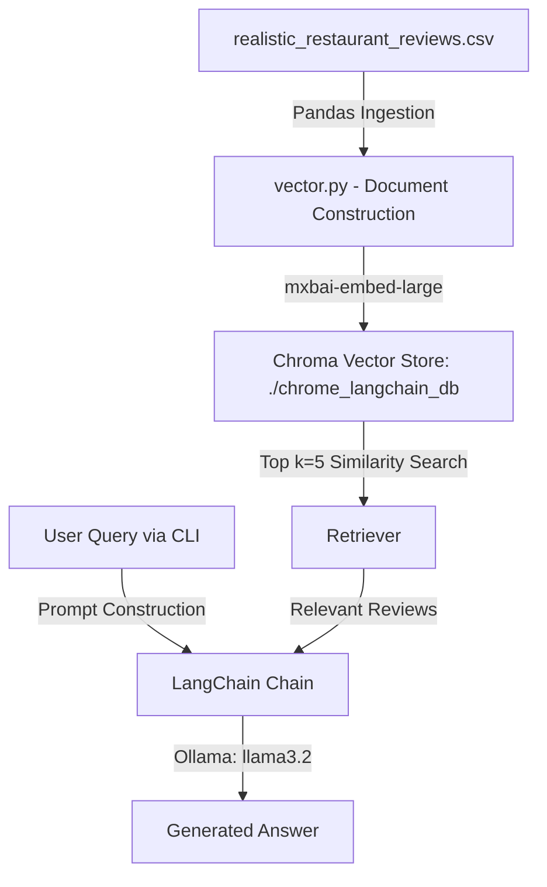

# LocalAIAgentWithRAG

A local Retrieval-Augmented Generation (RAG) system built with **LangChain**, **Ollama**, **ChromaDB**, and **Pandas** to answer questions about pizza restaurant reviews.

---

## 🌟 Architecture Overview



---

## 📁 Repository Structure

- **[main.py](file:///Users/sovannarith/Desktop/LocalAIAgentWithRAG/main.py)**: Interactive command-line chat loop. Prompts the user for questions, retrieves top relevant reviews via ChromaDB, passes context to Ollama (`llama3.2`), and streams answers.
- **[vector.py](file:///Users/sovannarith/Desktop/LocalAIAgentWithRAG/vector.py)**: Ingests `realistic_restaurant_reviews.csv`, converts rows to LangChain `Document` objects, embeds texts using `mxbai-embed-large`, persists vector embeddings to `./chrome_langchain_db`, and exposes `retriever`.
- **[realistic_restaurant_reviews.csv](file:///Users/sovannarith/Desktop/LocalAIAgentWithRAG/realistic_restaurant_reviews.csv)**: CSV dataset containing 124 detailed restaurant reviews (`Title`, `Date`, `Rating`, `Review`).
- **[chrome_langchain_db](file:///Users/sovannarith/Desktop/LocalAIAgentWithRAG/chrome_langchain_db)**: Persistent directory holding ChromaDB embeddings and vector index.
- **[.agents/](file:///Users/sovannarith/Desktop/LocalAIAgentWithRAG/.agents/)**: AI agent configuration rules (`AGENTS.md`) and custom skills (`auto-subagent`, `project-context`).

---

## 🚀 Requirements & Prerequisites

1. **Python**: 3.10+ (Recommended Python 3.14 via Pipenv)
2. **Ollama**: Installed and running locally ([ollama.com](https://ollama.com/))
3. **Ollama Models**:
   ```bash
   ollama pull llama3.2
   ollama pull mxbai-embed-large
   ```

---

## 🛠️ Installation & Setup

### Using Pipenv
```bash
pipenv install
pipenv shell
```

### Using pip
```bash
pip3 install -r requirements.txt
```

---

## 🏃 Running the Agent

Start the interactive QA terminal session:
```bash
python3 main.py
```

### Example Usage:
```text
Ask your question (q to quit): What is the best pizza place for gluten-free options?

Ask your question (q to quit): Which reviews complained about cold delivery?
```