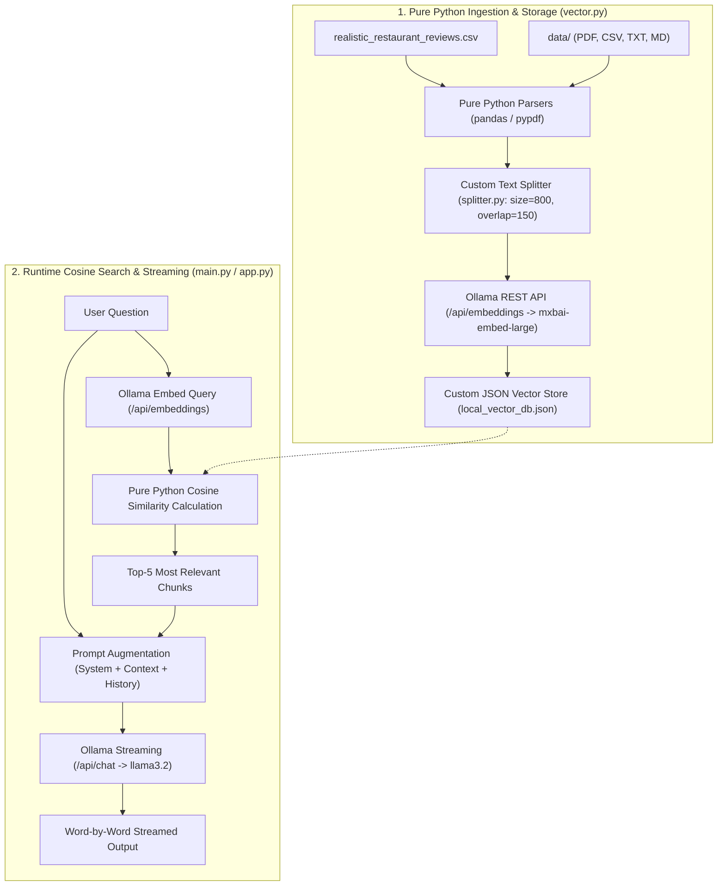

# 🍕 Pure Python Local RAG QA Assistant (Built from Scratch)

A 100% local, lightweight **Retrieval-Augmented Generation (RAG)** assistant built **completely from scratch in pure Python** with **Zero LangChain Dependencies**.

---

## 🌟 Why Built from Scratch?

* **No Black-Box Frameworks**: Every component (parsing, chunking, vector storage, cosine similarity, and streaming) is written in transparent, clean Python.
* **Pure Math Vector Search**: Implements standard mathematical **Cosine Similarity** directly:
  $$\text{Cosine Similarity}(A, B) = \frac{\sum (A_i \times B_i)}{\sqrt{\sum A_i^2} \times \sqrt{\sum B_i^2}}$$
* **Direct Ollama REST API**: Communicates directly with local Ollama endpoints (`/api/embeddings` and `/api/chat`) using standard HTTP requests.
* **Fast JSON Vector Persistence**: Stores embeddings and metadata locally in `local_vector_db.json`.
* **Zero API Cost & 100% Privacy**: Runs offline with local models **`llama3.2`** and **`mxbai-embed-large`**.

---

## 🏗️ Architecture Overview



---

## 📁 Repository Structure

```text
LocalAIAgentWithRAG/
├── app.py                             # Streamlit Web UI (Pure Python RAG)
├── main.py                            # Interactive CLI Terminal Chat (Pure Python RAG)
├── ollama_client.py                   # Direct REST API Client for Ollama (/api/embeddings, /api/chat)
├── vector.py                          # Pure Python Vector Store with Cosine Similarity Math & Parsing
├── splitter.py                        # Pure Python Text Chunking (sliding window with overlap)
├── retrieval.py                       # Standalone Vector Search Test Script
├── realistic_restaurant_reviews.csv   # Base Review Dataset (124 Customer Reviews)
├── data/                              # User Uploaded Documents (PDFs, Menus, etc.)
├── local_vector_db.json               # Custom Persistent JSON Vector Database
├── requirements.txt                   # Minimal Dependencies (requests, pandas, pypdf, streamlit)
└── README.md                          # Documentation
```

---

## 🚀 Prerequisites

### 1. Install Ollama
Download and install from [ollama.com](https://ollama.com/).

### 2. Pull Local AI Models
```bash
# Pull the LLM Generation Model
ollama pull llama3.2

# Pull the 1024-dimensional Embedding Model
ollama pull mxbai-embed-large
```

---

## 🛠️ Installation & Setup

```bash
# 1. Clone repo
git clone https://github.com/Soeun-Sovannarith/RAG_Implementation.git
cd LocalAIAgentWithRAG

# 2. Create and activate virtual environment
python3 -m venv venv
source venv/bin/activate    # On Windows: venv\Scripts\activate

# 3. Install lightweight dependencies (NO LangChain)
pip install -r requirements.txt
```

---

## 🏃 Running the Application

### Option 1: Streamlit Web UI (Recommended)
```bash
streamlit run app.py
```
> Opens in your browser at `http://localhost:8501`. Features include document upload, ground-truth source inspector, and token streaming.

### Option 2: Interactive Terminal CLI
```bash
python3 main.py
```

### Option 3: Test Vector Retrieval Standalone
```bash
python3 retrieval.py
```

---

## 🧮 Core Math: Cosine Similarity in `vector.py`

```python
def cosine_similarity(vec_a: list[float], vec_b: list[float]) -> float:
    dot_product = sum(a * b for a, b in zip(vec_a, vec_b))
    norm_a = math.sqrt(sum(a * a for a in vec_a))
    norm_b = math.sqrt(sum(b * b for b in vec_b))
    if norm_a == 0.0 or norm_b == 0.0:
        return 0.0
    return dot_product / (norm_a * norm_b)
```